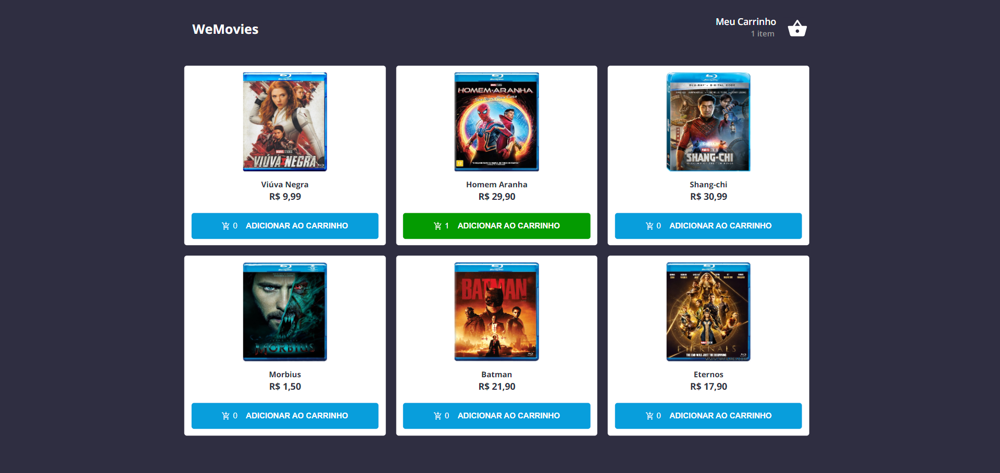

# Desafio WeFit

## Hospedagem do site

O site está hospedado no domínio: https://teste-wefit-react.netlify.app

## Orientações de Instalação

Siga estas instruções para instalar e executar o projeto em sua máquina local:

1. Clone o repositório Git em sua máquina local.
2. Abra o terminal em seu VSCode.
3. No terminal, digite `yarn` para instalar as dependências do projeto.
4. Após a instalação das dependências, digite `yarn start`. O servidor será iniciado na porta localhost:3000.
5. O projeto começará a rodar.

## Funcionalidades

O sistema inclui:

1. Página Home com requisição na API, trazendo assim, a lista de filmes que podem ser adicionados ao carrinho.
2. Página de carrinho onde o usuário poderá ver os itens que foram adicionados, somar o valor total com base em cada item adicionado, podendo remover qualquer item do carrinho. Por padrão, se o carrinho não tiver nenhum item adicionado, aparecerá a tela de 'Carrinho vazio', com a opção de voltar para tela inicial.
3. Página de compra realizada, onde o usuário é direcionado após finalizar a compra, esta tela também inclui uma opção para voltar à página inicial.
4. Responsividade para dispositivos de largura mínima de 370px e altura mínima de 760px.

## 🤝 Responsável pelo projeto

<table>
  <tr>
    <td align="center">
      <a href="#">
       
        
          <b> Pedro Henrique</b>
        
      </a>
    </td>
  </tr>
</table>